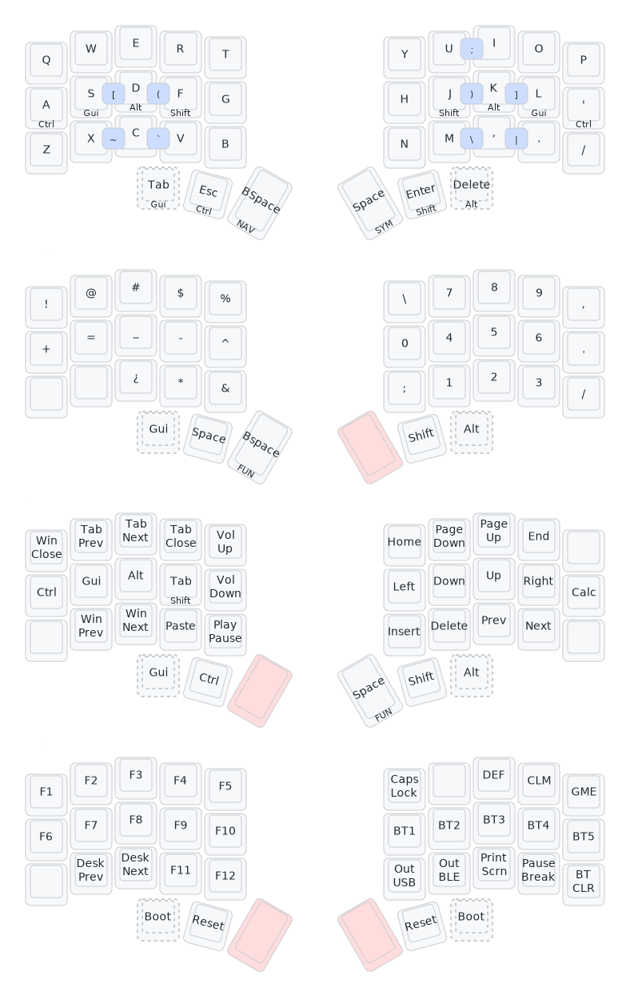

# Dbeans' keymap

## Initial
Keyboard build and configured by https://github.com/anrodfa/

## Keymapping
I use nickcoutsos's keymap-editor https://nickcoutsos.github.io/keymap-editor/, and caksoylar's 
visualisation: [https://keymap-drawer.streamlit.app/](https://keymap-drawer.streamlit.app/?zmk_url=https%3A%2F%2Fgithub.com%2Fdbeans%2Fcorne_5_3_qwerty%2Fblob%2Fmain%2Fconfig%2Fcorne.keymap)

## Planned changes:
* Change symbol layer. Inspiration:
  * symbol map of https://github.com/DesyncTheThird/corne-keymap -> inverted (), [], {} for nicer rolling  
  * https://getreuer.info/posts/keyboards/symbol-layer/index.html
  * https://mulldotin.wordpress.com/2019/02/03/layers-36keys/
  * no-teaching layout linked on https://www.reddit.com/r/crkbd/comments/12y5hip/coding_layout/: http://imgur.com/a/DKzQ9TL
  * https://mattgemmell.com/the-corne-keyboard/
* Add mouse layer
* Shift is nicely available on both sides, but CTRL and ALT are not very intuitive. Want to try home row mod
  * some combos for cut/copy/paste
* Implement some combos for faster navigation 
  * arrows are bit too hidden
  * how to jump to start/end of line, page up/down

## Overview
[https://caksoylar.github.io/keymap-drawer](https://caksoylar.github.io/keymap-drawer?keymap_yaml=H4sIAAAAAAACA41UbVPaQBD-7q_YXt_b8yVBRHE6UwJBbRGpgNYqTSOcwhASmhytjqV_rTP9Zd29vBiCcfrhnuRun93bffbuHPvWm8nyCsD3ydgai9tLz_YHZeh7viss35O2FAO0OopnufZElKFROTvqdqxg6oykVbgpWoUVtAs_oDg1s04fgFU4_8ThlIPJ4ZhDh8MZhy6HAw5HHFq9mHQ3LENV-g4HWYbKnAMt7M1Gat6O5hVHqnktmreHo6twpY4rexz2s-sfMp4fM5Eb0TzZmr1k8ySpLxw-c6hyOOFgcGhyOOTAOOOwxmE9piXxgAJ07EsMdDtFha6HXiDnKVa4C7HMoJ82NCsnkbvRntp9kba1zw4j27IpqdN0pfDTJlWw8qoJR0ixlBOGTTrEnmBJ7D3BU4JnBM8JLi4ISwTbBDtMCZAoxN7SwjsCi2CV4CvBBsEmQZFgi2Dt3tGdOShFiOzvH7K-IXhBsEugEegEBYL1xPdOxv1bVllJlOIZAS1wQEXq3WYiUOg5FM4gcSQpU47hgVncALt0L9npyIWq4wWCksOmQ8sXP-L_priR8X9COvEc6E7xb9-bYEqsZV8LqHk_XRZPlNV0B6EwiVbhsVElq7QWW497zKPoUbCGIBNN8KpN8d6Nroe4ULWdfkZ_VUWcOP3HibfsQKqkW3inoWXPVAkHbiB8Ch0dKfLkymcx48c6RMXkt-EuPubZlv1Pf5Ce9KeucajrOAo4NnEUsZiqPQ2g4fXHLD56-E6hMA28YXuHZiJOfQsdSji2cezg0DbwAehoBDpBgWCToJhVtCaCcSKpmkSa1jVKSUN_djST0G0bLPo1GqaS2h-5Etp9PzoQqDkYvrApW2Z0MM3jhTtgeJ58UOJjEQj5mMZLS4seD4bue5NLT73tSJmW4VzHSvRCj8MYX81vmKODiwwFZb15ioVF63rE-p3HQr1LPXqviLWbxyLttHjHV7ksDKaVItbrXBbmpcV5neey8BBo2xGrl1sj7qjHO6oX82EaBtPjYL8yrH8ZU1cCgwcAAA%3D%3D)

